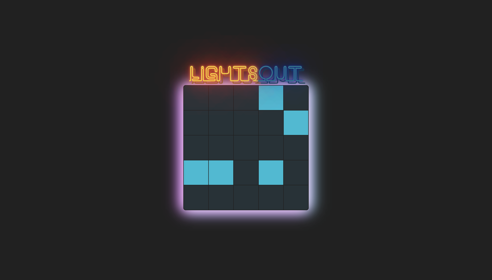

# Lights Out Clone

REACT | CSS

Inspired by [Lights Out](https://en.wikipedia.org/wiki/Lights_Out_(game)), a puzzle game consisting of a 5 by 5 grid of lights. When the game starts, a random number of these lights are switched on. By selecting any of the lights will toggle it and its adjacent lights. The goal of the game is to switch all the lights off. Can you solve it?

[Neon Flux](https://codepen.io/Trinca/pen/NAvpWa) Codepen by Thomas Trinca

Project Idea: Colt Steele
